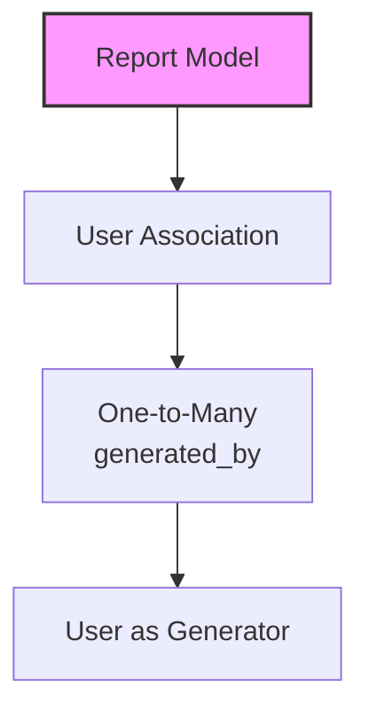
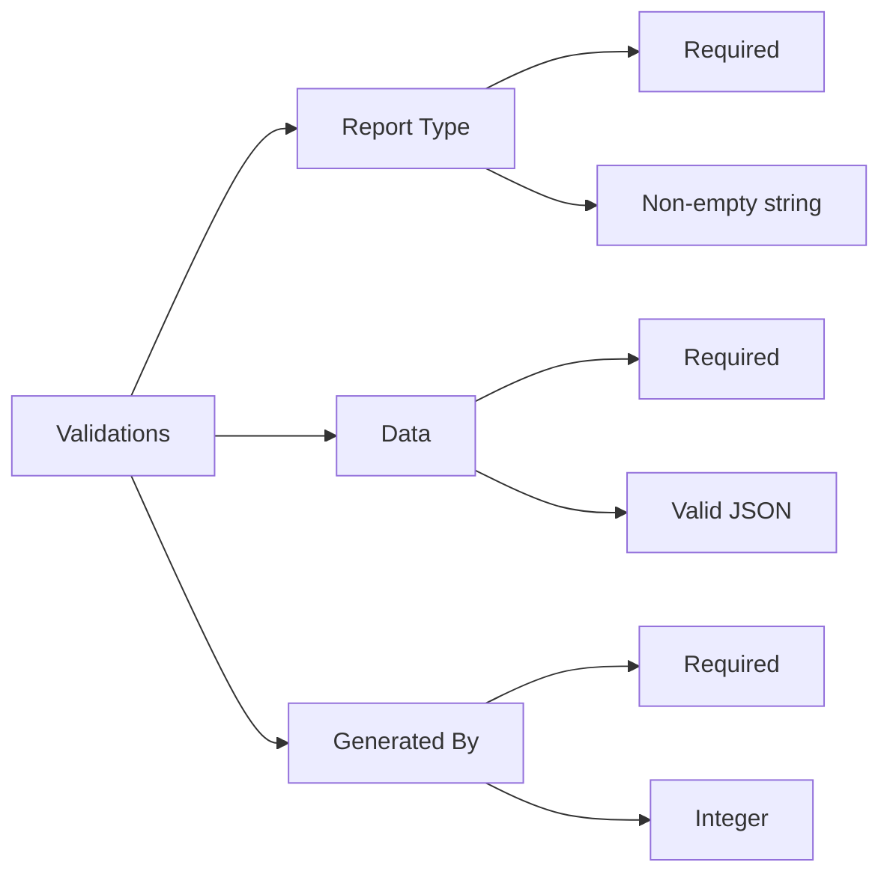
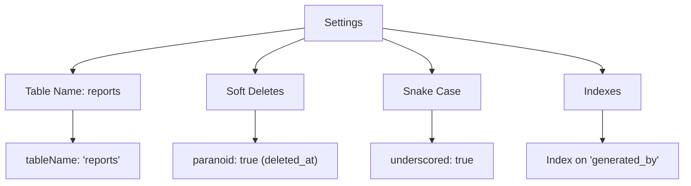

# Report Model Documentation

## ER Diagram
```erDiagram
    Report ||--o| User : "generated by (generated_by)"

    Report {
        INTEGER id PK
        STRING report_type "Type of report"
        JSON data "Report data"
        INTEGER generated_by FK "Reference to users"
        TIMESTAMP created_at
        TIMESTAMP updated_at
        TIMESTAMP deleted_at "Soft delete"
    }

    User {
        INTEGER id PK
        STRING email
        STRING status
    }
```

---

## Relationships


---

## Model Details

### Fields
| Field Name       | Type       | Constraints                          | Description                          |
|------------------|------------|--------------------------------------|--------------------------------------|
| `id`             | INTEGER    | Primary Key, Auto Increment         | Unique identifier for the report     |
| `report_type`    | STRING     | Not Null                            | Type of report (e.g., sales, logs)   |
| `data`           | JSON       | Not Null                            | JSON data for the report             |
| `generated_by`   | INTEGER    | Foreign Key to `users`, Not Null    | Reference to the user who generated the report |
| `created_at`     | TIMESTAMP  | Not Null, Default: CURRENT_TIMESTAMP| Timestamp of creation                |
| `updated_at`     | TIMESTAMP  | Not Null, Default: CURRENT_TIMESTAMP| Timestamp of last update             |
| `deleted_at`     | TIMESTAMP  | Nullable                            | Timestamp of soft deletion           |

### Associations
- **User:** A report is generated by a user (`belongsTo`).  

### Indexes
1. **Primary Key:** `id` (unique identifier).  
2. **Foreign Key Index:** On `generated_by` for faster lookups.  

---

## Usage Examples

### Create a Report
```javascript
await Report.create({
  report_type: 'sales_summary',
  data: { total_sales: 10000, region: 'North' },
  generated_by: 1
});
```

### Fetch All Reports for a User
```javascript
const userReports = await Report.findAll({
  where: { generated_by: 1 }
});
```

### Update a Report
```javascript
await Report.update(
  { report_type: 'monthly_sales' },
  { where: { id: 1 } }
);
```

### Soft Delete a Report
```javascript
await Report.destroy({
  where: { id: 1 }
});
```

### Restore a Soft-Deleted Report
```javascript
await Report.restore({
  where: { id: 1 }
});
```

---

## Validation Rules


---

## Model Settings


---

## Example Scenario

### Generate a Sales Report
```javascript
const salesReport = await Report.create({
  report_type: 'sales_summary',
  data: { total_sales: 15000, region: 'South' },
  generated_by: 2
});
```

### Fetch Reports by Type
```javascript
const salesReports = await Report.findAll({
  where: { report_type: 'sales_summary' }
});
```

---

## Notes
- **Soft Delete:** Enabled via `paranoid: true`. Reports are not permanently deleted but marked with `deleted_at`.  
- **JSON Data:** The `data` field stores flexible report data in JSON format.  
- **Cascading Effects:** Deleting a user will delete associated reports (due to `onDelete: 'CASCADE'`).  

---

## Best Practices
1. **Validate JSON Data:** Ensure `data` contains valid and expected fields for each `report_type`.  
2. **Index Optimization:** Use the `generated_by` index for faster queries on user-specific reports.  
3. **Avoid Hard Deletes:** Use soft deletes to maintain historical data.  

*This documentation ensures clarity and alignment with the `Report` model.*