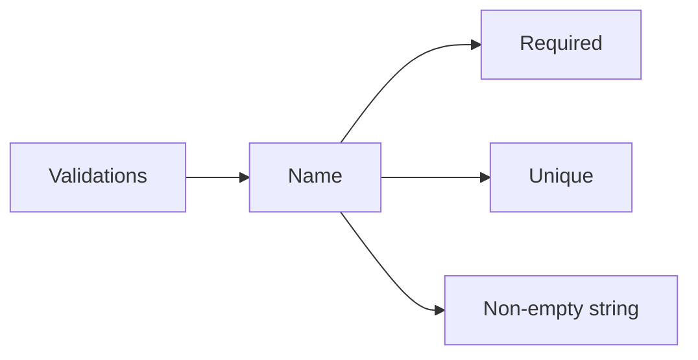
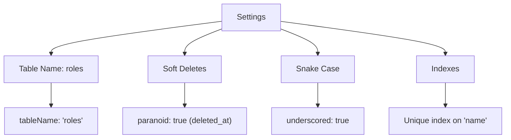

# Role Model Documentation

## ER Diagram
```erDiagram
    Role ||--o{ User : "has many (role_id)"
    Role ||--o{ Permission : "has many (role_id)"

    Role {
        INTEGER id PK
        STRING name UK "Unique role name"
        TIMESTAMP created_at
        TIMESTAMP updated_at
        TIMESTAMP deleted_at "Soft delete"
    }

    User {
        INTEGER id PK
        STRING email
        INTEGER role_id FK
    }

    Permission {
        INTEGER id PK
        STRING name
        INTEGER role_id FK
    }
```

---

## Relationships
```mermaid
graph TD
    A[Role Model] --> B[User Association]
    A --> C[Permission Association]

    B --> D[One-to-Many<br>users (role_id)]
    C --> E[One-to-Many<br>permissions (role_id)]

    style A fill:#f9f,stroke:#333,stroke-width:2px
```

---

## Model Details

### Fields
| Field Name     | Type       | Constraints                          | Description                          |
|----------------|------------|--------------------------------------|--------------------------------------|
| `id`           | INTEGER    | Primary Key, Auto Increment         | Unique identifier for the role       |
| `name`         | STRING     | Unique, Not Null                    | Unique name for the role             |
| `created_at`   | TIMESTAMP  | Not Null, Default: CURRENT_TIMESTAMP| Timestamp of creation                |
| `updated_at`   | TIMESTAMP  | Not Null, Default: CURRENT_TIMESTAMP| Timestamp of last update             |
| `deleted_at`   | TIMESTAMP  | Nullable                            | Timestamp of soft deletion           |

### Associations
- **Users:** A role can have many users (`hasMany`).  
- **Permissions:** A role can have many permissions (`hasMany`).  

### Indexes
1. **Primary Key:** `id` (unique identifier).  
2. **Unique Name Index:** Ensures `name` is unique across all roles.  

---

## Usage Examples

### Create a Role
```javascript
await Role.create({
  name: 'admin'
});
```

### Fetch All Roles
```javascript
const roles = await Role.findAll();
```

### Update a Role Name
```javascript
await Role.update(
  { name: 'superadmin' },
  { where: { id: 1 } }
);
```

### Soft Delete a Role
```javascript
await Role.destroy({
  where: { id: 1 }
});
```

### Restore a Soft-Deleted Role
```javascript
await Role.restore({
  where: { id: 1 }
});
```

---

## Validation Rules


---

## Model Settings


---

## Example Scenario

### Assign Permissions to a Role
```javascript
// Create permissions for the 'admin' role
await Permission.bulkCreate([
  { name: 'create_users', role_id: 1 },
  { name: 'delete_users', role_id: 1 }
]);
```

### Get All Users with a Role
```javascript
const adminRole = await Role.findOne({
  where: { name: 'admin' },
  include: 'users'
});
```

---

## Notes
- **Soft Delete:** Enabled via `paranoid: true`. Roles are not permanently deleted but marked with `deleted_at`.  
- **Unique Role Names:** Enforced at the database level via unique index.  
- **Cascading Effects:** Deleting a role will affect associated users/permissions (depending on your migration constraints).  

---

## Best Practices
1. **Predefined Roles:** Create essential roles (e.g., 'admin', 'user') during database seeding.  
2. **Avoid Hard Deletes:** Use soft deletes to maintain referential integrity.  
3. **Index Utilization:** Leverage the unique index for fast role name lookups.  

*This documentation ensures clarity and alignment with the `Role` model.*