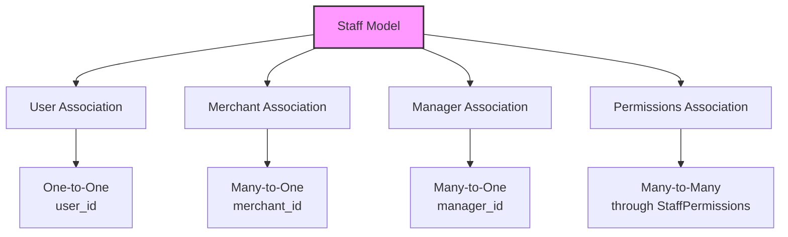
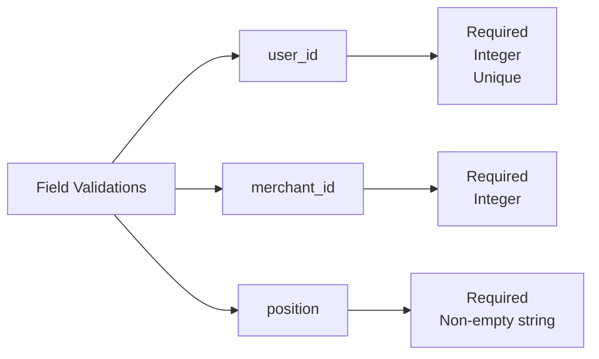
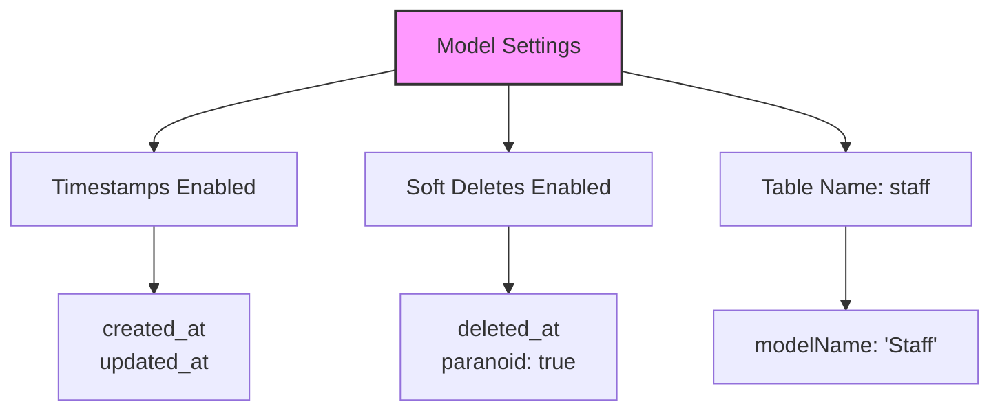
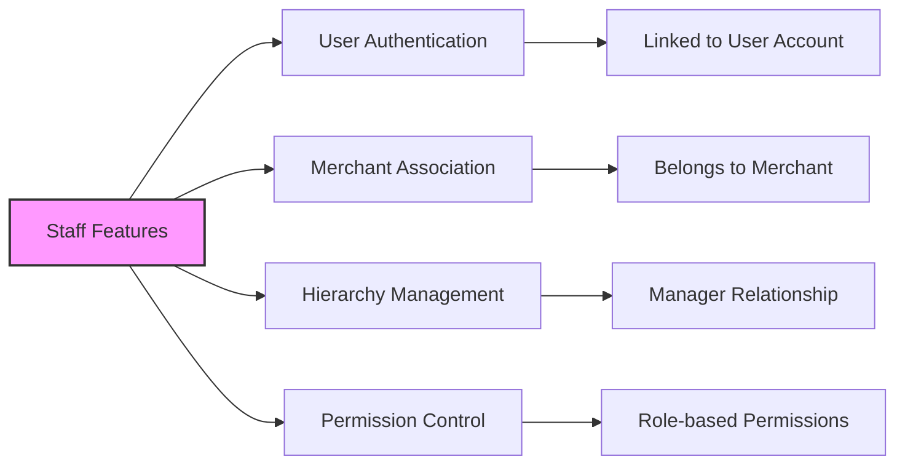

# Staff Model Documentation

## ER Diagram
```erDiagram
    Staff ||--|| User : belongs_to
    Staff ||--|| Merchant : belongs_to
    Staff ||--o| User : managed_by
    Staff ||--o{ StaffPermissions : has
    StaffPermissions }o--|| Permission : references

    Staff {
        INTEGER id PK
        INTEGER user_id FK "Reference to Users (unique)"
        INTEGER merchant_id FK "Reference to Merchants"
        STRING position "Staff position"
        INTEGER manager_id FK "Reference to Users (manager)"
        TIMESTAMP created_at
        TIMESTAMP updated_at
        TIMESTAMP deleted_at "Soft delete"
    }

    User {
        INTEGER id PK
        STRING name
        STRING email
        STRING status
    }

    Merchant {
        INTEGER id PK
        STRING name
        STRING type
        STRING status
    }

    Permission {
        INTEGER id PK
        STRING name
        STRING description
    }

    StaffPermissions {
        INTEGER staff_id PK,FK
        INTEGER permission_id PK,FK
    }
```

---

## Relationships


---

## Field Validations


---

## Model Settings


---

## Staff Features


---

## Model Details

### Fields
| Field Name       | Type      | Constraints                          | Description                          |
|------------------|-----------|--------------------------------------|--------------------------------------|
| `id`             | INTEGER   | Primary Key                          | Unique identifier for the staff      |
| `user_id`        | INTEGER   | Foreign Key to `users`, Unique       | Reference to the associated user     |
| `merchant_id`    | INTEGER   | Foreign Key to `merchants`           | Reference to the associated merchant |
| `position`       | STRING    | Not Null                             | Staff position                       |
| `manager_id`     | INTEGER   | Foreign Key to `users`               | Reference to the manager             |
| `created_at`     | TIMESTAMP | Not Null, Default: CURRENT_TIMESTAMP | Timestamp of creation                |
| `updated_at`     | TIMESTAMP | Not Null, Default: CURRENT_TIMESTAMP | Timestamp of last update             |
| `deleted_at`     | TIMESTAMP | Nullable                             | Timestamp of soft deletion           |

### Associations
- **User:** A staff member belongs to a user (`belongsTo`).  
- **Merchant:** A staff member belongs to a merchant (`belongsTo`).  
- **Manager:** A staff member can be managed by another user (`belongsTo`).  
- **Permissions:** A staff member has many permissions through `StaffPermissions` (`hasMany`).  

### Indexes
1. **Primary Key:** `id` (unique identifier).  
2. **Foreign Key Indexes:** Automatically created for `user_id`, `merchant_id`, and `manager_id`.  
3. **Unique Constraint:** `user_id` must be unique to ensure one-to-one relationship with `User`.  

---

## Usage Examples

### Create a Staff Member
```javascript
await Staff.create({
  user_id: 1,
  merchant_id: 5,
  position: 'Manager',
  manager_id: 2
});
```

### Fetch All Staff for a Merchant
```javascript
const staffMembers = await Staff.findAll({
  where: { merchant_id: 5 }
});
```

### Update a Staff Member's Position
```javascript
await Staff.update(
  { position: 'Senior Manager' },
  { where: { id: 1 } }
);
```

### Soft Delete a Staff Member
```javascript
await Staff.destroy({
  where: { id: 1 }
});
```

### Restore a Soft-Deleted Staff Member
```javascript
await Staff.restore({
  where: { id: 1 }
});
```

---

## Notes
- **Soft Delete:** Enabled via `paranoid: true`. Records are not permanently deleted but marked with `deleted_at`.  
- **Unique User Association:** Each staff member is linked to a unique user (`user_id` is unique).  
- **Permission Management:** Permissions are managed through the `StaffPermissions` join table.  

---

## Example Scenario

### Assigning Permissions to a Staff Member
```javascript
await StaffPermissions.create({
  staff_id: 1,
  permission_id: 10
});
```

### Fetching All Permissions for a Staff Member
```javascript
const staffPermissions = await StaffPermissions.findAll({
  where: { staff_id: 1 }
});
```

---

## Best Practices
1. **Validate Data:** Ensure `user_id`, `merchant_id`, and `manager_id` exist in their respective tables before creating a staff member.  
2. **Use Soft Deletes:** Avoid permanent deletion to maintain historical data.  
3. **Index Optimization:** Leverage foreign key indexes for faster queries.  

*This documentation ensures clarity and alignment with the `Staff` model.*