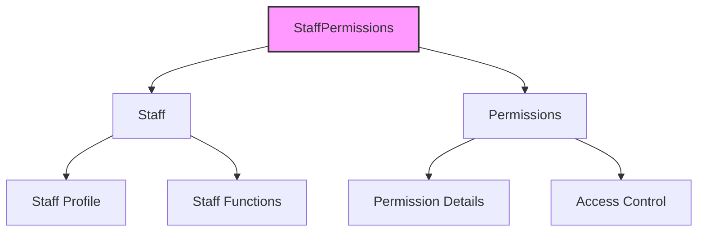

# StaffPermissions Model Documentation

## ER Diagram
```erDiagram
    staff_permissions ||--o{ staff : "belongs to (staff_id)"
    staff_permissions ||--o{ permissions : "belongs to (permission_id)"

    staff_permissions {
        INTEGER staff_id PK, FK "Reference to staff"
        INTEGER permission_id PK, FK "Reference to permissions"
    }
```

---

## Relationships


---

## Model Details

### Fields
| Field Name       | Type     | Constraints                          | Description                          |
|------------------|----------|--------------------------------------|--------------------------------------|
| `staff_id`       | INTEGER  | Primary Key, Foreign Key to `staff`  | Reference to the staff member        |
| `permission_id`  | INTEGER  | Primary Key, Foreign Key to `permissions` | Reference to the permission         |

### Associations
- **Staff:** A staff permission belongs to a staff member (`belongsTo`).  
- **Permissions:** A staff permission belongs to a permission (`belongsTo`).  

### Indexes
1. **Composite Primary Key:** Combines `staff_id` and `permission_id` to ensure uniqueness.  
2. **Foreign Key Indexes:** Automatically created for `staff_id` and `permission_id`.  

---

## Usage Examples

### Assign a Permission to a Staff Member
```javascript
await StaffPermissions.create({
  staff_id: 1,
  permission_id: 5
});
```

### Fetch All Permissions for a Staff Member
```javascript
const staffPermissions = await StaffPermissions.findAll({
  where: { staff_id: 1 }
});
```

### Remove a Permission from a Staff Member
```javascript
await StaffPermissions.destroy({
  where: {
    staff_id: 1,
    permission_id: 5
  }
});
```

### Check if a Staff Member Has a Specific Permission
```javascript
const hasPermission = await StaffPermissions.findOne({
  where: {
    staff_id: 1,
    permission_id: 5
  }
});

if (hasPermission) {
  console.log('Staff member has the permission.');
} else {
  console.log('Staff member does not have the permission.');
}
```

---

## Notes
- **Composite Primary Key:** Ensures that each `staff_id` and `permission_id` combination is unique.  
- **Cascade Deletes:** If a staff member or permission is deleted, the associated `StaffPermissions` record is also deleted.  
- **Timestamps:** Disabled, as this is a join table and does not require `created_at` or `updated_at`.  

---

## Example Scenario

### Assigning Multiple Permissions to a Staff Member
```javascript
const permissionsToAssign = [
  { staff_id: 1, permission_id: 5 },
  { staff_id: 1, permission_id: 10 },
  { staff_id: 1, permission_id: 15 }
];

await StaffPermissions.bulkCreate(permissionsToAssign);
```

### Fetching All Permissions for Multiple Staff Members
```javascript
const staffIds = [1, 2, 3];
const staffPermissions = await StaffPermissions.findAll({
  where: { staff_id: staffIds }
});
```

---

## Best Practices
1. **Use Bulk Operations:** For assigning multiple permissions, use `bulkCreate` for better performance.  
2. **Validate Permissions:** Ensure `permission_id` exists in the `permissions` table before assigning.  
3. **Cascade Handling:** Be cautious with cascade deletes to avoid unintended data loss.  

*This documentation ensures clarity and alignment with the `StaffPermissions` model.*