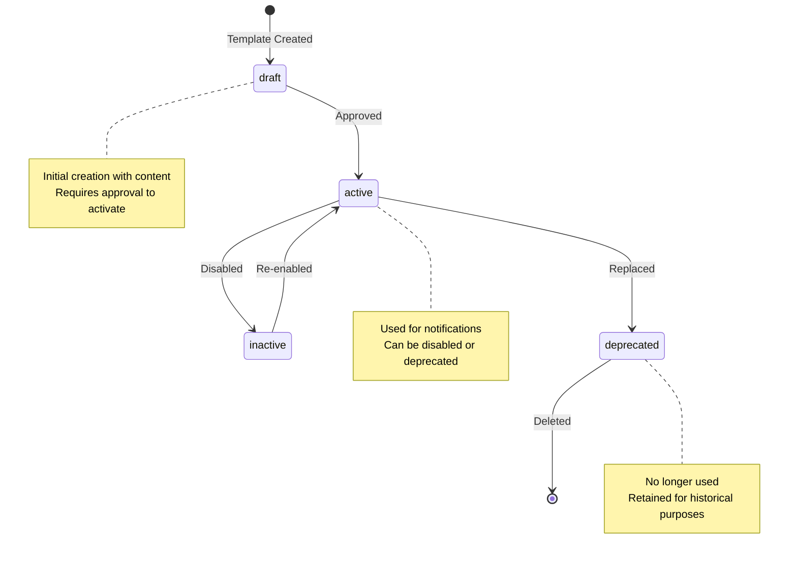
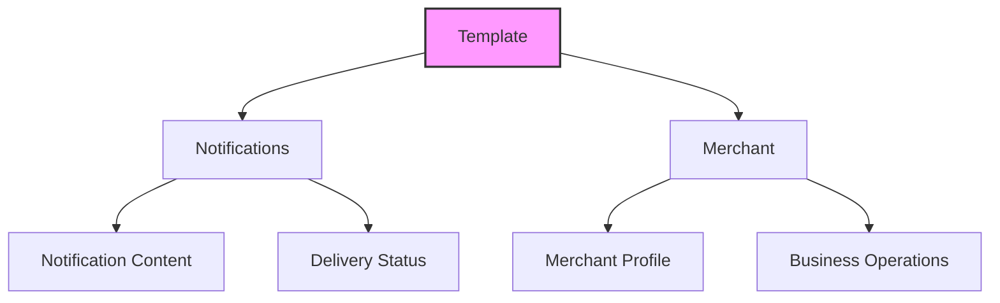
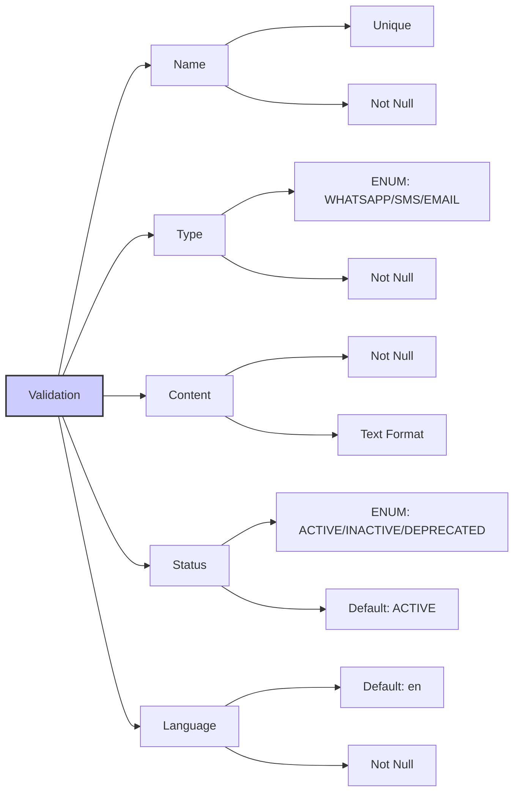
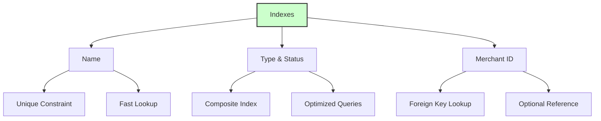

# Template Model Documentation

## ER Diagram
```erDiagram
    templates ||--o{ notifications : "has (template_id)"
    templates ||--o| merchants : "belongs to (merchant_id)"

    templates {
        UUID id PK
        STRING name UK "Unique name"
        ENUM type "WHATSAPP/SMS/EMAIL"
        TEXT content "Template content"
        ENUM status "ACTIVE/INACTIVE/DEPRECATED"
        STRING language "Default: en"
        INTEGER merchant_id FK "Optional reference to merchants"
        TIMESTAMP created_at
        TIMESTAMP updated_at
    }
```

---

## State Diagram (Template Lifecycle)


---

## Relationships


---

## Validation and Indexes


---

## Indexes


---

## Model Details

### Fields
| Field Name     | Type           | Constraints                          | Description                          |
|----------------|----------------|--------------------------------------|--------------------------------------|
| `id`           | UUID           | Primary Key, Default: UUIDV4        | Unique identifier for the template   |
| `name`         | STRING         | Unique, Not Null                    | Unique name for the template         |
| `type`         | ENUM           | WHATSAPP/SMS/EMAIL, Not Null        | Type of notification template        |
| `content`      | TEXT           | Not Null                            | Content of the template              |
| `status`       | ENUM           | ACTIVE/INACTIVE/DEPRECATED, Default: ACTIVE | Current status of the template       |
| `language`     | STRING         | Default: 'en', Not Null             | Language of the template             |
| `merchant_id`  | INTEGER        | Optional, Foreign Key to `merchants`| Associated merchant (if applicable)  |
| `created_at`   | TIMESTAMP      | Not Null, Default: CURRENT_TIMESTAMP| Timestamp of creation                |
| `updated_at`   | TIMESTAMP      | Not Null, Default: CURRENT_TIMESTAMP| Timestamp of last update             |

### Associations
- **Notifications:** A template can have many notifications (`hasMany`).  
- **Merchant:** A template can belong to a merchant (`belongsTo`).  

### Indexes
1. **Unique Name Index:** Ensures `name` is unique across all templates.  
2. **Composite Index on Type & Status:** Optimizes queries filtering by `type` and `status`.  
3. **Merchant ID Index:** Improves lookup performance for templates associated with a merchant.  

---

## Usage Examples

### Create a Template
```javascript
const template = await Template.create({
  name: 'welcome_email',
  type: 'EMAIL',
  content: 'Welcome to our service, {{name}}!',
  status: 'ACTIVE',
  language: 'en',
  merchant_id: 1
});
```

### Fetch Active Templates
```javascript
const activeTemplates = await Template.findAll({
  where: { status: 'ACTIVE' }
});
```

### Update Template Status
```javascript
await Template.update(
  { status: 'INACTIVE' },
  { where: { id: templateId } }
);
```

### Delete a Template
```javascript
await Template.destroy({
  where: { id: templateId }
});
```

---

## Notes
- **Soft Delete:** Not implemented. Use `status: 'DEPRECATED'` for archival purposes.  
- **Localization:** The `language` field supports localization for multi-language templates.  
- **Merchant Association:** Optional, allowing templates to be either global or merchant-specific.  

*This documentation ensures clarity and alignment with the `Template` model.*