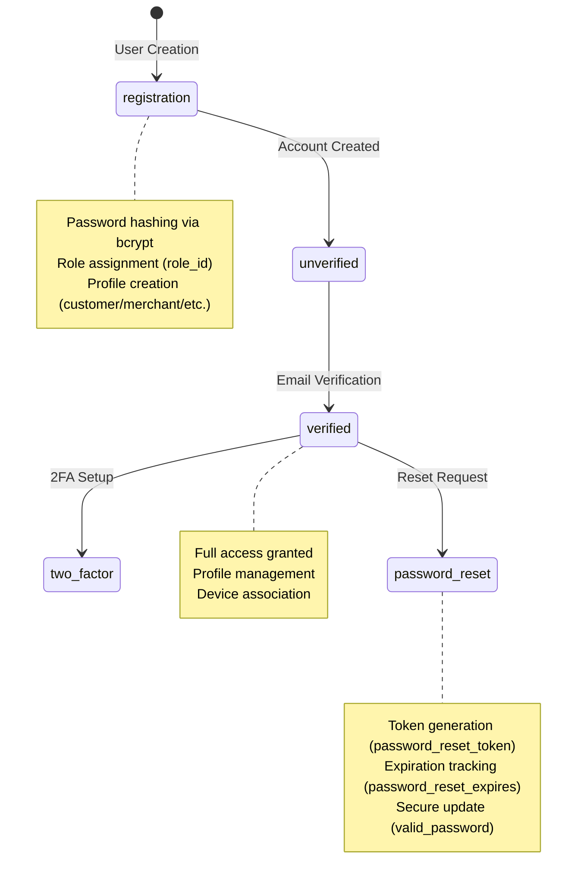
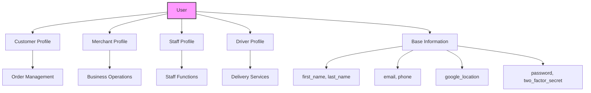

# User Model Documentation

## ER Diagram (Corrected to Match Model)
```erDiagram
    users ||--o| roles : "belongs to (role_id)"
    users ||--o| customers : "has (user_id)"
    users ||--o| merchants : "has (user_id)"
    users ||--o| staff : "has (user_id)"
    users ||--o| drivers : "has (user_id)"
    users ||--o| users : "managed by (manager_id)"
    users ||--o{ notifications : "receives (user_id)"
    users ||--o{ customer_payments : "processes (customer_id)"
    users ||--o{ driver_payments : "processes (driver_id)"
    users ||--o{ reports : "generates (generated_by)"
    users ||--o{ devices : "owns (user_id)"

    users {
        INTEGER id PK
        STRING first_name "2-50 characters"
        STRING last_name "2-50 characters"
        STRING email UK "Valid email format"
        STRING password "Hashed, min 6 chars"
        INTEGER role_id FK "Reference to roles"
        JSON google_location "Optional location data"
        STRING phone UK "Validated format"
        ENUM country "malawi/zambia/mozambique/tanzania"
        ENUM merchant_type "grocery/restaurant (optional)"
        BOOLEAN is_verified "Default: false"
        INTEGER manager_id FK "Optional self-reference (users)"
        STRING two_factor_secret "2FA implementation"
        STRING password_reset_token "Password recovery"
        DATE password_reset_expires "Token expiration"
        TIMESTAMP created_at
        TIMESTAMP updated_at
        TIMESTAMP deleted_at "Soft delete"
    }
```

---

## State Diagram (Registration Flow)


---

## Profile Relationships


---

## Validation System
```mermaid
graph LR
    A[Validation] --> B[Personal Info]
    A --> C[Contact Details]
    A --> D[Security]
    A --> E[Geography]
    
    B --> B1[first_name/last_name (2-50 chars)]
    B --> B2[Country ENUM]
    
    C --> C1[Email Format]
    C --> C2[Phone Validation]
    
    D --> D1[Password (min 6 chars)]
    D --> D2[Token Expiry]
    
    E --> E1[Country ENUM]
    E --> E2[Google Location JSON]

    style A fill:#ccf,stroke:#333,stroke-width:2px
```

---

## Security Features
```mermaid
graph TD
    A[Security] --> B[Password]
    A --> C[2FA]
    A --> D[Reset]
    
    B --> B1[Bcrypt Hashing]
    B --> B2[Salt Rounds (10)]
    
    C --> C1[Secret Storage (two_factor_secret)]
    C --> C2[TOTP Verification]
    
    D --> D1[Token (password_reset_token)]
    D --> D2[Expiry (password_reset_expires)]

    style A fill:#cfc,stroke:#333,stroke-width:2px